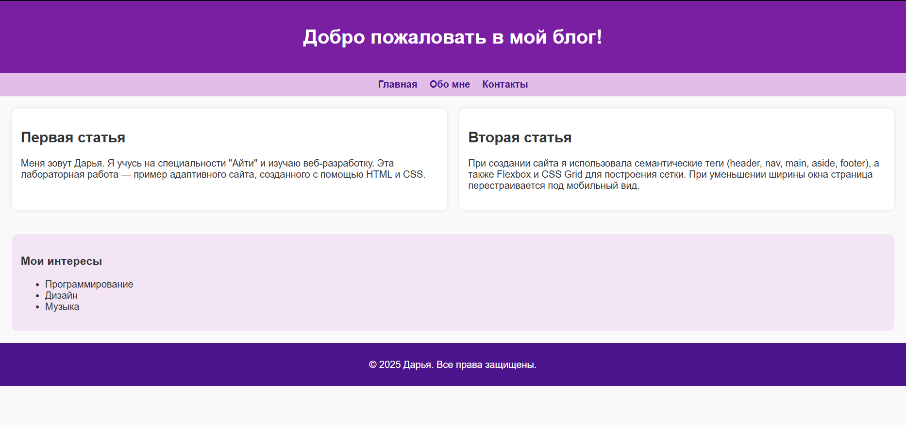
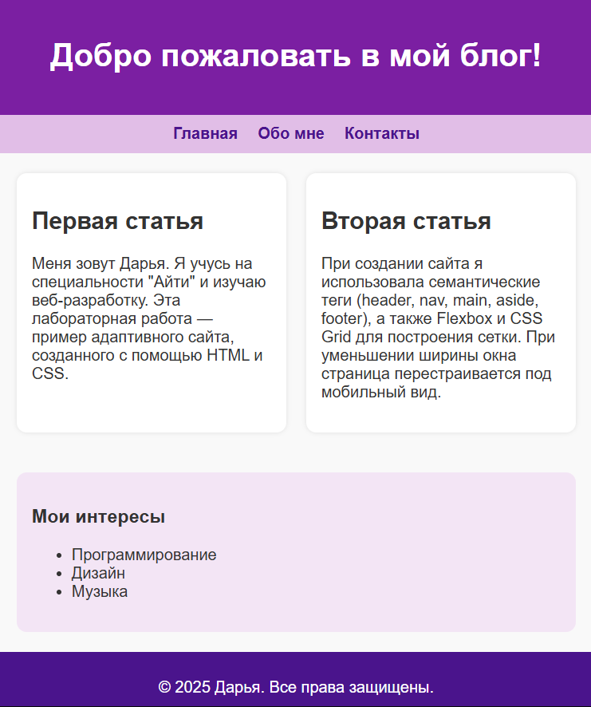

# Лабораторная работа №2

## Скриншоты
- Версия для компьютера: 
- Версия для телефона: 

## Ответы на вопросы

**1. Какие семантические теги использованы:**  
header, nav, main, article, aside, footer  

**2. Где использован flexbox:**  
В навигации (`nav`) для расположения ссылок в ряд; на мобильной версии ссылки выстраиваются в колонку  

**3. Где использован grid:**  
В основном контенте (`main`) для расположения двух статей в две колонки  

**4. Медиазапрос:**  
```css
@media (max-width: 600px) { ... }
